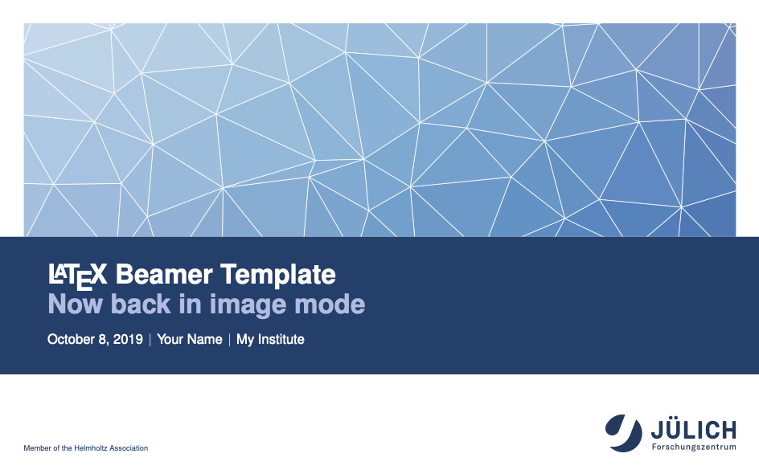

# Forschungszentrum Jülich LaTeX Beamer Theme

This repository hosts the LaTeX Beamer theme for presentations using the Forschungszentrum Jülich corporate design.

## Installation

* Download the repository in archived form either in
    * [zip](https://gitlab.version.fz-juelich.de/kabadshow1/beamertheme-juelich/-/archive/master/beamertheme-juelich-master.zip), or
    * [tar.gz](https://gitlab.version.fz-juelich.de/kabadshow1/beamertheme-juelich/-/archive/master/beamertheme-juelich-master.tar.gz), [tar.bz2](https://gitlab.version.fz-juelich.de/kabadshow1/beamertheme-juelich/-/archive/master/beamertheme-juelich-master.tar.bz2), [tar](https://gitlab.version.fz-juelich.de/kabadshow1/beamertheme-juelich/-/archive/master/beamertheme-juelich-master.tar).
* Unpack the repository
    * `unzip beamertheme-juelich-master.zip`, or
    * `tar xf beamertheme-juelich-master.tar.bz2`.
* Move files to your `texmf` tree; you have multiple options
    * Preferred: `mv ./beamertheme-juelich-master $HOME/texmf/tex/latex/beamertheme-juelich` (you might need to `mkdir -p $HOME/texmf/tex/latex/` before)
    * Alternatively: `mv ./beamertheme-juelich-master /usr/share/texmf/tex/latex/beamertheme-juelich` or `mv ./beamertheme-juelich-master /usr/local/share/texmf/tex/latex/beamertheme-juelich`
* Test your fresh installation:
    * `cd $HOME/texmf/tex/latex/beamertheme-juelich/` and
    * `pdflatex minimal.tex`
* Use in your own presentation with `\usetheme{Juelich}`
* _Instead of a global theme installation, one can also locally install the theme into any directory, as long as it included in `$TEXINPUTS`._

The [Tutorial](tutorial/tutorial.pdf) has more details and examples!

## Features

The Jülich LaTeX Beamer theme implements the full corporate design in a Beamer-compatible fashion. Most (well, hopefully all) usual Beamer commands are adapted to Jülich needs and can be used.

Titles are set in Jülich's blue and all caps, sub-titles are available if needed. The Jülich logo is placed in the lower right, while "Member of the Helmholtz Association" is printed in the lower left. Between, date and page number are printed. But all of this can be changed – and more!




Some available configuration features:

* Change the **language** of the document with:  
  `\usepackage[ngerman,english]{babel}\selectlanguage{ngerman}`  
  (this will also change "Member of the Helmholtz Association" to "Mitglied der Helmholtz-Gemeinchaft")
* All Jülich **colors** are available:  
  `fzjblue`, `fzjorange`, `fzjviolet`, `fzjyellow`, `fzjgreen`, `fzjred`, `fzjlightblue`.
* Highlight something in Jülich red with `\alert{something}`
* Create a footer-less **plain** frame with  
  `\begin{frame}[plain]…\end{frame}`
* Set the **aspect ratio** of slides to modern 16:9: `\documentclass[aspectratio=169]{beamer}`
* Set the background of a frame by changing the according Beamer template:  
  ```
  {
  \setbeamertemplate{background}{\includegraphics[width=\paperwidth]{myimage.pdf}}
  \begin{frame}…\end{frame}
  }
  ```
* Set other Beamer templates:
    - Slide numbers, for example full display (to include total amount): `\setbeamertemplate{frame number}[full]`
    - Set a partner logo and use a template, for example: `\setbeamertemplate{footer element1}[logo]{jara}` (will display `jara.pdf` at first position in the footer)
* Set Jülich CD-specific template:
    - Show **image on title page**: `\fzjset{title page=image}`
    - Use only text on section page: `\fzjet{section page=text}`
    - Set slideshow title in **all caps**: `\fzjset{title=allcaps}`
    - Set frame title in regular style: `\fzjset{frametitle=regular}`
* Support for progress bar:
    - Enable: `\setbeamertemplate{progressbar}[visible]`
    - Change height: `\fzjset{progress bar/height=1ex}`
    - See [progressbar.tex](tutorial/progressbar.tex) / [progressbar.pdf](tutorial/progressbar.pdf)

## Contributing

Contributions are very welcome!  
Either file an issue or directly submit a merge request with your changes. Be aware that your merged changes are also licensed under the MIT license.

## Authors

This project is authored by [Ivo Kabadshow](mailto:i.kabadshow@fz-juelich.de), with contributions by: Andreas Beckmann, Andreas Herten, Benedikt Steinbusch.
